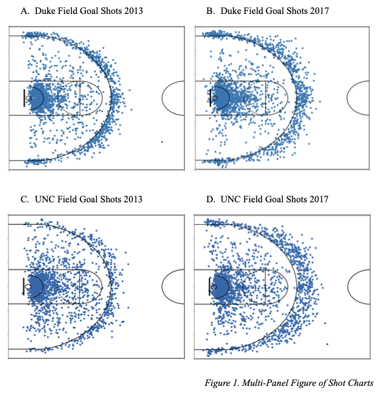
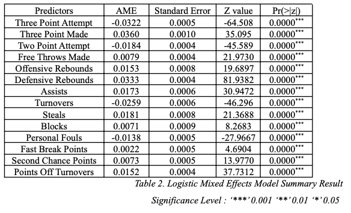
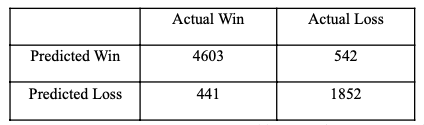
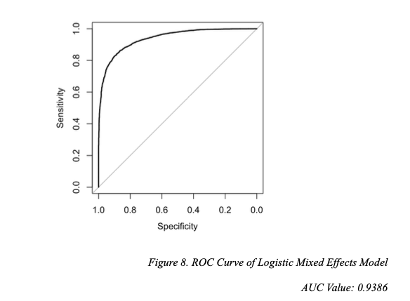

# basketball-analytics

*author*: Che Hoon, Jeong

# Introduction

This project explores the three point strategy in the NCAA. In recent years, numerous NBA teams have found success by utilizing the three point shot. Given this phenomenon, this project investigates if the same trend is reflected in the NCAA Division 1 league. A Logistic Mixed Effects Regression model was created to examine the impact of box score statistics in win probability. Seasonal Mann Kendall test was used to determine whether college basketball players are attempting three point shots at greater distances throughout the years.

# Brief Overview

**Refer to** `Che Research Paper.pdf` file **for full research paper.**

**EDA: Shot Chart Visualization**

 

Duke University is one of the powerhouse basketball programs in the NCAA, with a total of 11 national championship appearances. 

We observe:
- Greater 3PA further behind the three point arc during the 2017 season than the 2013 season
- Greater volume of three point shots taken during the 2017 season
- Greater shot attempts near the basket and behind the three point line, compared to mid-range shots

The University of North Carolina (UNC), who were the 2017 NCAA Division 1 champions, display similar patterns.

We observe: 
- Higher volume of three point shots in 2017 than 2013. 
- More three pointers are shot further behind the arc in 2017 than in 2013.

 

**Model Results**

 

Average Marginal Effects (AME) Chart.

The AME value of three point attempts is -0.0322. In other words, on average, an increase in one three point shot attempt decreases the probability of winning by 3.22%, holding other variables constant. Moreover, the AME value of three points made is 0.036. Thus, on average, an increase in one made three point shot increases the probability of winning by 3.6%, holding other variables constant.

 

**Confusion Matrix**

 

- Accuracy: 0.8678
- Specificity: 0.7736
- Sensitivity: 0.9126 

 

**ROC Curve**

 

The AUC value of the model is 0.9386, which indicates that the model performs much better than random chance. Thus, the model is capable of classifying wins and losses very accurately.

# Data

The NCAA boxscore and play-by-play data was retrieved from the Google Cloud BigQuery database uploaded by SportsRadar and the NCAA. Command used is available in the `sqlcommands` file under the Code directory. Play-by-play data is not uploaded in this repository because it exceeds the data size limit.

- /Data/NCAA/ncaa_boxscore.csv: box score data of NCAA games

# Code Files

|File Name.    |Description|
|--------------|-----------|
|analysis.ipynb|Python code that generates shot chart visualization. Generate `distanceToBasket` variable|
|ncaa-analysis.rmd|R markdown file that test assumptions, create, and evaluate Logistic Mixed Effects Model of NCAA boxscore data|
|sqlcommand.rtf |Text file of SQL command to extract data from Google BigQuery Database of NCAA *shot* data|
|sqlcommand_boxscore.rtf | Text file of SQL command to extract data from Google BigQuery Database of NCAA *boxscore* data|

# Versions and Packages

**Python 3.9.12**

|Name|Version number|
|----|--------------|
|Matplotlib|Package|3.5.1|
|Pandas|Package|1.4.2|

**R 4.2.1**
|Name|Version number|
|----|--------------|
|lmerTest|3.1.3|
|estimatr|1.0.0|
|car|3.1.1|
|corrplot|0.92|
|MASS|7.3.58.1|
|dplyr|1.0.9|
|ggplot2|3.3.6|
|margins|0.3.26|
|caret|6.0.93|
|InformationValue|1.2.3|
|ISLR|1.4|
|WeMix|3.2.4|
|Kendall|2.2.1|
|xts|0.12.1|
|tsbox|0.3.1|
|pROC|1.18.0|

# Variable Codebook

**Boxscore**
Boxscore Dataset Key Variable Codebook

|Variable|Description|
|--------|----------|
|win|Binary 1(win) 0(loss)|
|season|NCAA season|
|three_points_att|Number of three point shots attempted|
|three_points_made|Number of three point shots made|
|two_points_att|Number of two point shots attempted|
|two_points_made|Number of two point shots made |
|free_throws_att|Number of free throws attempted|
|free_throws_made|Number of free throws made|
|offensive_rebounds|Number of offensive rebounds|
|defensive_rebounds|Number of defensive rebounds|
|assists|Number of assists|
|turnover|Number of turnovers|
|steals|Number of steals|
|blocks|Number of blocks|
|personal_fouls|Number of personal fouls|
|fast_break_pts|Number of points scored through fast breaks|
|second_chance_pts|Number of points scored through second chance shots|
|points_off_turnovers|Number of points scored through turnovers|

**Play-By-Play Data**
Play-By-Play Dataset Key Variable Codebook

|Variable|Description|
|--------|----------|
|team_id|team id|
|team_name|team name|
|timestamp|timestamp of play in yyyy-mm-dd hour:min:sec UTC format|
|team_basket|side of team's basket (left, right)|
|event_coord_x|x-coordinate of play. Origin: bottom-left. Value range: 0~1128|
|event_coord_y|y-coordinate of play. Origin: bottom-left. Value range: 0~600|
|three_point_shot|dummy variable. (true, false)|

